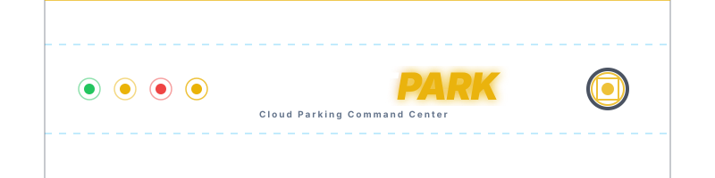

<p align="center">
  
</p>

<p align="center">
  
  
  
  
  
</p>

---

# 🅿️ Smart Parking System

A modern, cloud-synced **Smart Parking Command Center** and **Driver Booking Platform**. The system features a lightweight, high-performance frontend designed for **Vercel** and a computer vision/OCR scanning backend designed for **Render**.

---

## 🎨 Premium Features & Interface

### ⚙️ 1. Role-Aware Settings Panel
A fully integrated, dynamic settings console customized by user access level:
*   👤 **Driver Preferences**: 
    *   Configure preferred default vehicle type (Car vs. Bike).
    *   Save default payment methods (UPI, FASTag, Debit/Credit Card) to instantly populate checkouts.
    *   Set default parking zones/buildings to automatically show upon login.
    *   Manage up to 3 saved vehicle plates for instant Fast-Track bookings.
*   🛠️ **Admin System Controls**:
    *   Configure hourly rates for Cars (₹) and Bikes (₹) dynamically in-memory.
    *   Define OCR Confidence threshold (%) to customize camera auto-scan stability rules.
    *   Enable/Disable offline fallback Auto-Verification matching.
    *   Set the **Alert Threshold (%)** to trigger UI warning alerts and record alerts to logs when capacity limits are exceeded.

### 📊 2. Admin Command Center Tab Panel
-   🏢 **Tab 1: Slots & Logs**
    *   Displays a custom 2-lane interactive blueprint layout for Building 1 (Slots 1–20).
    *   Slots feature real-time color states: **Green** (Available), **Red/Yellow** (Occupied), and **Striped Hatching** (Maintenance).
    *   Includes click-to-book manual controls, override systems, and a live terminal log.
-   📷 **Tab 2: Camera & Logs**
    *   Integrates a live camera canvas stream overlaying green detection bounding boxes on plates at 5 FPS.
    *   Features manual scan buttons to query OCR engines and sync with database logs.
    *   *Performance Optimization:* Switching tabs automatically suspends the camera stream and stops backend requests to optimize CPU/battery.
-   📈 **Tab 3: Analytics Dashboard**
    *   **KPI Cards:** Track Gross Earnings (₹), Capacity Utilization (%), and Total Bookings.
    *   **Customization:** Switch palettes dynamically (**Cyber Neon**, **Emerald Sea**, or **Golden Amber**), toggle grid lines, and filter across buildings and timelines (Today, Week, Month).
    *   **Interactive Charts:** Live lines and bars displaying Revenue Trends, Occupancy Distribution, Peak traffic hours, and Vehicle Category breakdowns.

### ⚡ 3. Realtime & Actual Data Analytics
*   Calculates all metrics dynamically using real database state and transaction metadata (action, amount, vehicleNo, vehicleType, building, timestamp).
*   Zero simulated placeholders or makeup multipliers—empty states reflect pure, live data.

### ✨ 4. Unverified Vehicle Aesthetics
*   Parked vehicles awaiting verification showcase a premium, smooth flowing golden background shimmer (`yellow-shimmer`), breathing yellow border glow, pulsing caution badge, and yellow vehicle icons. Once verified via OCR or admin details, they transition cleanly into a solid red state with a green shield checkmark.

---

## 📂 Project Structure

```bash
├── backend/                  # Python FastAPI API
│   ├── app.py                # Server entry point, OCR scanning & object detection routes
│   ├── firebase_service.py   # Firebase Admin initialization & cloud syncing
│   ├── ocr_service.py        # Multi-pass OpenCV & Tesseract OCR pipeline
│   └── requirements.txt      # Backend Python dependencies
├── frontend/                 # Static web application files (Vercel)
│   ├── assets/
│   │   ├── css/styles.css    # Premium CSS styles, flowing shimmer, & glow keyframes
│   │   └── js/script.js      # App state, auth routing, settings management, & charts
│   ├── index.html            # Main frontend HTML5 layout
│   └── assets/images/
│       └── banner.svg        # Custom animated SVG header banner
├── firestore.rules           # Firestore cloud database security rules
└── README.md                 # Project documentation
```

---

## 🚀 How to Deploy

> [!IMPORTANT]
> This project is designed to be hosted serverless. Do not run standard dev server commands in production.

### 🌐 Frontend (Vercel)
1. Push the repository to GitHub.
2. Import the project into **Vercel** and select the `frontend/` directory as the root folder.
3. Configure Firestore Security Rules using the included `firestore.rules`.
4. Open the deployed Vercel URL, click **Setup Cloud** in the top navbar, and paste your Firebase Web SDK config JSON object to link your database.

### 🐍 Backend (Render)
1. Create a Web Service on **Render** pointing to the `backend/` directory of your repository.
2. Select **Python** as the runtime environment.
3. Install Tesseract OCR on the Render instance (or include `tesseract-ocr` under package dependencies).
4. Generate a Firebase Service Account key JSON file from your Firebase console, save it as `serviceAccountKey.json` inside the `backend/` folder, and configure Render to reference it.

---

## 🧪 How to Test (Driver to Admin Portal Workflow)

To test the end-to-end cloud communication and visual states, perform the following steps:

### Step 1: Book a Slot (Driver Portal)
*   Log in as a driver (e.g., `driver@smartpark.com` / `driver123` in offline mode).
*   Go to the **Fast Track** panel at the top, enter a demo license plate number (e.g., `MH 12 AB 1234`), select **Car**, and click **Book**.
*   *Alternative:* Click on any green "Open" slot on the blueprint grid, enter the plate, and confirm.

### Step 2: Verify Unverified Visual States (Admin Portal)
*   Log in as an admin on another browser window/tab (e.g., `admin@smartpark.com` / `admin123`).
*   Navigate to the **Slots & Logs** tab.
*   **Result:** You will see the slot you booked immediately turn yellow with a **pulsing warning shield** and a **smooth flowing gold shimmer gradient**. This indicates the vehicle is unverified.
*   The log stream will display a yellow line: `[Time] PARK: MH12AB1234` or `AUTO-BOOK: Slot X for MH12AB1234`.

### Step 3: Check Live Analytics Updates
*   Click the **Analytics** tab.
*   **Result:** The **Capacity Utilization** card and chart will show the exact 5% occupancy increase. The **Total Bookings** KPI will increment by 1, and the **Vehicle Categories** chart will update to show 1 Car.

### Step 4: Verify the Plate (OCR/Admin Scan)
*   On the **Camera & Logs** tab, standard scans matching the plate will mark it verified, or offline mock verification will automatically fire if Auto-Verify is enabled.
*   **Result:** The slot on the blueprint turns solid red and the yellow caution shield changes into a **green check shield**, signaling a verified state. The log stream adds: `[Time] VERIFIED: MH12AB1234`.

### Step 5: Perform Checkout & Earnings Tracking
*   In the **Driver Portal**, click on the occupied slot.
*   A Checkout modal will pop up, calculating the duration and pricing (using your custom configured settings rates) and defaulting to your saved payment preference.
*   Click **Confirm & Pay**.
*   **Result:** The slot returns to green ("Open"). In the **Admin Portal** -> **Analytics** tab, the **Gross Earnings** KPI card and the **Revenue Over Time** chart instantly reflect the paid amount.
